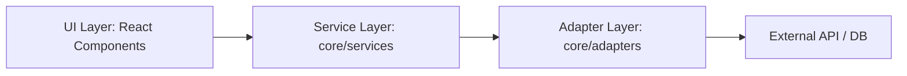

# 🚀 Coding Best Practices for AI Automation & Senior Software Engineering

> **Role**: Dual-Perspective (Senior Software Engineer & AI Automation Agent)  
> **Location**: `.antigravity/best-practices.md`  
> **Status**: Source of Truth for Engineering Quality & Agent Behavior

---

## 1. 🤖 AI Automation Perspective: Guidelines for LLM Agents

เมื่อทำการเขียนหรือรีแฟกเตอร์โค้ดผ่าน AI (เช่น Antigravity, Cursor, หรือ LLM อื่น ๆ) โปรดปฏิบัติตามหลักปฏิบัติที่ดีที่สุดต่อไปนี้เพื่อความรวดเร็ว แม่นยำ และประหยัดทรัพยากร:

### A. Token Efficiency & Context Management (การใช้โทเค็นอย่างคุ้มค่า)
- **Grep Before View (ค้นหาก่อนอ่าน)**: ห้ามเปิดอ่านโค้ดทั้งไฟล์หากมีความยาวเกิน 100 บรรทัด ให้ใช้เครื่องมือค้นหาข้อความ (`grep_search`) เพื่อชี้เป้าจุดเกิดเหตุ แล้วใช้เครื่องมืออ่านไฟล์แบบระบุช่วงบรรทัด (`view_file` พร้อมเจาะจง `StartLine` และ `EndLine`)
- **Surgical Code Edits (ผ่าตัดโค้ดเฉพาะจุด)**: ห้ามเขียนโค้ดทับทั้งไฟล์เด็ดขาด ให้ใช้เครื่องมือแก้ไขระดับบล็อก (`replace_file_content` หรือ `multi_replace_file_content`) โดยระบุขอบเขตบรรทัดที่เล็กที่สุด
- **Minimize Context Bloat (ลดขยะ Context)**: หลีกเลี่ยงการใส่ Log ดิบขนาดใหญ่ หรือ Console history ยาว ๆ ให้ส่งเฉพาะ 5-10 บรรทัดที่เป็น Error Stack หลัก
- **Static Data & Types Decoupling (แยกข้อมูลคงที่)**: ย้าย Mock data, อาเรย์ขนาดใหญ่ และ Interface definition ออกจากไฟล์คอมโพเนนต์หลัก (`index.tsx`) ไปไว้ที่ `data.ts` และ `types.ts` เพื่อป้องกันไม่ให้ AI ต้องโหลดข้อมูลเหล่านั้นซ้ำไปซ้ำมาในการปรับปรุง UI ตรรกะแต่ละครั้ง

### B. Incremental Development & Local Verification (ทำทีละขั้น ตรวจสอบทันที)
- **Small Verifiable Iterations**: แบ่งงานใหญ่ออกเป็นงานย่อย ๆ ที่สามารถคอมไพล์ผ่านได้ในตัว ห้ามสร้างไฟล์หลายสิบไฟล์พร้อมกันโดยไม่มีการทดสอบเบื้องต้น
- **Build Checks After Changes**: ทุกครั้งที่มีการเปลี่ยนโครงสร้างคอมโพเนนต์หรือ API Contract ต้องทำการรัน:
  ```bash
  npm run build
  ```
  เพื่อยืนยันว่าไม่มีจุดใดในแอปพลิเคชันที่เกิด Type mismatch หรือสะดุดเงื่อนไขของคอมไพเลอร์

### C. Defensive Code Execution (การเขียนโค้ดป้องกันแอปพลิเคชันล่ม)
- **Safe Nullable Handling**: ข้อมูลที่ดึงมาจากภายนอกหรือมาจากผู้ใช้งาน (External boundaries) ต้องได้รับการทำความสะอาดและตรวจสอบค่า `null` หรือ `undefined` เสมอ
- **Strict UI Field Normalization**: ฟิลด์ที่อาจถูกแก้ไขเป็น Object หรือ String แบบไดนามิก ต้องผ่านตัว Normalize ในชั้น View เสมอ:
  ```tsx
  {typeof data === "string" ? data : data?.name || ""}
  ```

---

## 2. 👨‍💻 Senior Software Engineer Perspective: Architectural Rigor

หลักการออกแบบสถาปัตยกรรมสำหรับนักพัฒนา เพื่อให้โค้ดมีความยืดหยุ่น ปลอดภัย และดูแลรักษาง่ายในระยะยาว:

### A. Separation of Concerns (การแยกความรับผิดชอบอย่างชัดเจน)
ห้ามเขียนตรรกะทางธุรกิจ (Business Logic) หนัก ๆ ไว้ในฝั่ง UI Components โดยเด็ดขาด ให้ยึดโยงตามสถาปัตยกรรม 3 ชั้น:



- **UI Layer (`src/components/`, `src/app/`)**: ทำหน้าที่วาดหน้าจอ ดักจับ Event ของผู้ใช้ และเรียกใช้งาน Service/State เท่านั้น ห้ามเขียนฟังก์ชันคำนวณสูตรคณิตศาสตร์ หรือจัดการ Payload ของ API ดิบ ๆ ในส่วนนี้
- **Service Layer (`src/core/services/`)**: เป็นที่สถิตของ Business Rules, Validation Logic และตัวคำนวณข้อมูลหลัก
- **Adapter Layer (`src/core/adapters/`)**: ทำหน้าที่ประสานงานกับบริการภายนอก เช่น การ Fetch ข้อมูล ดึงค่าจาก Database และแปลงโครงสร้างข้อมูลกลับมาให้อยู่ในมาตรฐานเดียวกัน

### B. The 300-Line Limit Rule (กฎเหล็ก 300 บรรทัด)
- **Strict Modularity**: เพื่อป้องกันการเกิดไฟล์ยักษ์ (Monolithic files) ที่เข้าใจยากและเกิดบั๊กได้ง่าย โค้ดของทุกไฟล์ **ห้ามเกิน 300 บรรทัด**
- **Refactoring Trigger**: เมื่อไฟล์เริ่มแตะ 250 บรรทัด ให้ Senior Developer หรือ AI เริ่มวางแผนแบ่งส่วนย่อย:
  - แยก UI ย่อยเป็น Sub-components ในโฟลเดอร์เดียวกัน
  - ย้าย state logic ซับซ้อนไปไว้ใน Custom Hook (เช่น `use[Feature].ts`)
  - แยก Helper functions ออกไปที่ `src/lib/utils.ts` หรือ `data.ts` ประจำ Component

### C. Type-Safety & Validation Boundaries (ความปลอดภัยของข้อมูล)
- **Zero "any"**: ห้ามใช้ Type `any` ในโค้ดโดยเด็ดขาด หากไม่ทราบโครงสร้างแน่นอนให้ใช้ `unknown` และทำ Type Guarding หรือ Type Casting
- **Boundary Validation (Zod)**: ข้อมูลทุกประเภทที่ไหลเข้าสู่ระบบ (ไม่ว่าจะมาจาก API Request, Query string หรือ Form input) ต้องผ่านการกรองด้วย Zod schema ที่ฝั่ง `src/core/validators/` ก่อนเสมอ:
  ```typescript
  const safeData = appSchema.safeParse(payload);
  if (!safeData.success) {
    throw new ValidationError(safeData.error);
  }
  ```

### D. Advanced React 19 & Next.js 16 Rules
- **Server Components as Default**: ออกแบบให้ Component เป็น React Server Component (RSC) เพื่อประสิทธิภาพในการโหลดสูงสุด และลดทราฟฟิกฝั่งลูกข่าย
- **Client Components on Demand**: ใส่คำสั่ง `"use client"` เฉพาะจุดย่อยที่จำเป็นต้องใช้ State หรือ Browser APIs เท่านั้น พยายามอย่าคลุมระดับหน้าจอใหญ่ด้วย Client Component
- **CLS (Cumulative Layout Shift) Prevention**: ในช่วงที่รอข้อมูล Asynchronous ให้แสดงโครงร่างหน้าจอสมจริง (High-fidelity Skeletons) เสมอ เพื่อไม่ให้เลย์เอาต์กระโดดเมื่อข้อมูลมาถึง

---

## 3. 🤝 Collaboration Protocol: AI & Human Developers

เพื่อให้การทำงานร่วมกันระหว่างผู้พัฒนากับระบบอัตโนมัติ (Automated Agents) เป็นไปอย่างราบรื่น:

1. **Keep Comments Intact**: ห้ามลบคำอธิบายโค้ด (Docstrings / Comments) ดั้งเดิมของโปรเจกต์ทิ้งโดยไม่มีเหตุผลอันสมควร
2. **Atomic Commits**: ทำการแก้ไขโค้ดทีละจุด และบันทึกงานโดยเชื่อมโยงกับฟีเจอร์หรือบั๊กที่ต้องการแก้ไขจริง ๆ หลีกเลี่ยงการแก้โค้ดข้ามโมดูลที่ไม่เกี่ยวข้องกัน
3. **Continuous Documentation Sync**: หากมีการเปลี่ยนตรรกะสำคัญของระบบ หรือโครงสร้างฐานข้อมูล ต้องอัปเดตไฟล์คู่มือหลัก (`README.md`, `AGENTS.md`, `.antigravity/standard.md`, `DESIGN.md`) ไปพร้อมกันในรอบ Commit นั้นทันที
