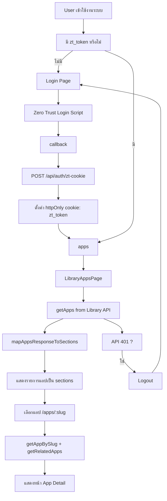

# Internal App Store (Adapter Library)

Internal App Store คือแอปภายในองค์กรสำหรับแสดงและเข้าถึง Library ของแอป/เครื่องมือภายใน (เช่น MCP, APIFY, MEDIA, APP) โดยเน้นความปลอดภัย, Server-first rendering และโครงสร้างที่แยกชั้น UI กับ Business Logic ชัดเจน

## Tech Stack

- Next.js 16 (App Router)
- React 19
- TypeScript 5
- Tailwind CSS 4
- Shadcn UI / Radix
- Zod 4 (strict validation)
- NextAuth.js 4 (มี endpoint รองรับ)
- Zero Trust Google Login script flow (ใช้งานจริงในหน้า login/callback)

## Current Architecture Summary

- Routing หลักของแอปอยู่ใต้ `/apps` และรายละเอียดแอปที่ `/apps/[slug]`
- มีการ redirect รองรับเส้นทางเก่า `/library/apps -> /apps` ผ่าน `next.config.ts`
- Data fetching หลักอยู่ใน `src/core/services/library.service.ts`
- API base URL บังคับผ่าน env `NEXT_PUBLIC_STORE_API_BASE_URL`
- Auth ที่ใช้งานจริงเป็น Zero Trust flow:
  - ปุ่ม login จาก script `/login-adapterstore/login-button.js`
  - callback ที่ `/callback`
  - บันทึก token เป็น httpOnly cookie (`zt_token`) ผ่าน `/api/auth/zt-cookie`
- Route protection ใช้ `src/proxy.ts` ตรวจ cookie `zt_token`

## Security Highlights

- Proxy ใส่ Content Security Policy (CSP) แบบ nonce ต่อ request
- ใส่ security headers เพิ่มเติมทั้งใน `src/proxy.ts` และ `next.config.ts`
- Private routes redirect ไป `/login` อัตโนมัติถ้าไม่มี `zt_token`
- Route สาธารณะหลัก: `/login`, `/callback`, `/api/auth/*`

## Environment Variables

ไฟล์ตัวอย่างอยู่ที่ `.env.example`

ค่าที่ใช้งานในโค้ดปัจจุบัน:

- `NEXTAUTH_URL`
- `NEXTAUTH_SECRET`
- `GOOGLE_CLIENT_ID`
- `GOOGLE_CLIENT_SECRET`
- `ALLOWED_EMAIL_DOMAIN`
- `NEXT_PUBLIC_STORE_API_BASE_URL`
- `NEXT_PUBLIC_ZT_AUTH_BASE_URL` (optional, มี fallback)
- `NEXT_PUBLIC_ZT_CLIENT_ID` (optional, มี fallback)
- `NEXT_PUBLIC_ZT_CALLBACK_PATH` (optional, default `/callback`)
- `NEXT_PUBLIC_ZT_DEBUG_CALLBACK` (optional, สำหรับ debug callback flow)

## Getting Started

1. Install dependencies

```bash
npm install
```

2. Prepare env

```bash
cp .env.example .env.local
```

3. Run dev server

```bash
npm run dev
```

4. Build production

```bash
npm run build
```

5. Start production server

```bash
npm run start
```

## Project Structure

```text
src/
  app/            UI pages, routes, layouts (App Router)
  components/     Shared UI components
  core/
    interfaces/   Contracts/types for domain and API responses
    validators/   Zod schemas (boundary validation)
    services/     API/service layer
    adapters/     External-to-internal data transformation
  lib/            Shared helpers (auth, sanitize, utils)
  types/          App/global type augmentation
  proxy.ts        Route guard + CSP/security headers
```

## Development Notes

- Default เป็น Server Components; ใช้ `"use client"` เฉพาะจำเป็น
- Validate external payload ที่ boundary เท่านั้น แล้วส่งต่อเป็น typed data
- หากเพิ่ม external image domain ต้องเพิ่มทั้ง `next.config.ts` และ CSP trusted sources ใน `src/proxy.ts`
- หากปรับ auth flow ต้องอัปเดตทั้ง `/login`, `/callback`, `/api/auth/zt-cookie`, และเงื่อนไขใน `src/proxy.ts`

## Project Workflow Summary

### Phase 1: Concept & Requirement

ระบบนี้ถูกออกแบบมาเพื่อเป็น Internal App Store สำหรับรวม MCP / Platform / Tool ภายในองค์กร โดยมีเป้าหมายหลัก:

- ให้ทีมค้นหาและเข้าถึงเครื่องมือได้จากจุดเดียว
- ควบคุมการเข้าถึงด้วย Zero Trust + cookie-based auth
- รักษาความปลอดภัยระดับระบบด้วย Route Guard และ CSP ในทุก request

### Phase 2: System Architecture & Flow



### Phase 3: Key Implementation

- Auth flow ชัดเจน: `/login` -> `/callback` -> `/api/auth/zt-cookie` -> `/apps`
- Route protection ส่วนกลาง: ตรวจ `zt_token` ใน proxy และ redirect ตามสถานะ login
- Security baseline ครบ: CSP (nonce-based), security headers, public/private path policy
- Service layer แยกชัด: `library.service` ดูแล fetch, auth header, error handling
- Mapping layer ชัดเจน: แปลงข้อมูล API เป็น UI sections ผ่าน `mapAppsResponseToSections`
- Component governance: มีมาตรฐานโครงสร้าง component ใน `src/components/COMPONENTS.md`

### Phase 4: Next Steps & Backlog

- เพิ่ม schema validation ที่ service boundary สำหรับ payload apps/banners
- ปรับหน้า detail ให้ดึงข้อมูลแบบ query by slug/id โดยตรง
- เพิ่ม integration tests สำหรับ `/login`, `/callback`, `/apps`, `/apps/[slug]`
- ทำ loading/empty/error state ให้ครบทุกหน้าที่ดึงข้อมูล
- เพิ่ม observability (structured logs, metrics, alerts)
- วาง quality gate ใน CI: build + lint + test + critical route checks

## Planning Alignment

### Requirement

- ระบบควรมีหน้าองค์กรพื้นฐาน เช่น About Us, Privacy, Terms เพื่อรองรับการใช้งานจริงในระดับองค์กร
- ระบบควรมีช่องทางรับ requirement ใหม่จากผู้ใช้ เช่น send mail หรือ request form
- ระบบควรรองรับ role-based access เพื่อแยกเมนูและสิทธิ์ตามกลุ่มผู้ใช้งาน
- ระบบควรตอบโจทย์ use case ใหม่ เช่น Prompt workflow, APIFY service, export comment service และการใช้งานข้ามทีม

### Feature

- Landing page: About Us, Privacy & Terms, requirement contact
- Detail page: เพิ่ม cover app และข้อมูลประกอบที่ชัดขึ้น
- Prompt module: UI สำหรับ CRUD และ workflow ของ comment loader + post analysis
- APIFY service: post message scraper
- Export comment service
- Library credits
- Additional menus ตามสิทธิ์ของแต่ละ role
- GCP project setup สำหรับงานที่ต้องพึ่ง external project/service

### Flow

- User เข้าระบบ -> เห็นเมนูตาม role -> เข้าหน้า landing หรือ library ตามสิทธิ์
- User เลือก app/service -> ดู detail พร้อม cover, เครดิต, เงื่อนไขการใช้งาน
- User ส่ง requirement ใหม่ -> ระบบพาไปฟอร์มหรือช่องทางติดต่อ
- User ฝั่ง prompt operations -> เข้า UI จัดการ CRUD -> โหลด comment -> วิเคราะห์ post -> export ผลลัพธ์
- ทีมงานใช้ wireframe เพื่อยืนยันว่าแต่ละ persona จะเจอหน้าอะไรและมีสิทธิ์ทำอะไรได้บ้าง

### Backlog

- Define personas และสิทธิ์เข้าถึง: Dev, ทีมพี่อุ้ย, ทีมอื่น, admin, viewer
- สรุป wireframe/UX flow รายหน้าก่อนลง implementation
- ระบุขนาดและ layout ของ app cover ใน detail page (กำหนดแล้ว)
  - ใช้ภาพเดียวรองรับทั้ง desktop/mobile
  - อัตราส่วนแนะนำ: 16:9
  - ขนาดแนะนำ (baseline): 2560x1440 px
  - ขนาดขั้นต่ำที่ยอมรับได้: 1920x1080 px
  - แนะนำฟอร์แมต WebP (หรือ AVIF)
- ออกแบบ data model สำหรับ prompt CRUD, comment source, analysis result, export job
- วาง integration plan สำหรับ APIFY, export service และ GCP project
- ออกแบบ role-based navigation และ menu visibility policy

## Documentation

- Contributor/developer rules: `.github/project-guidlines.md`
- Agent execution rules: `AGENTS.md`
- Component naming/structure standard: `src/components/COMPONENTS.md`
