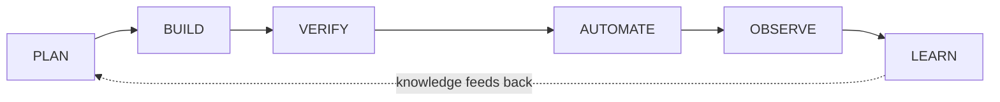

# Loop Studio

Loop Studio is a **local, single-user, no-auth** Next.js dashboard for driving AI
coding agents against **other repositories on the same machine**. You register (or
bootstrap) local projects, create tasks against them, and walk each task through a
six-stage loop:

**PLAN → BUILD → VERIFY → AUTOMATE → OBSERVE → LEARN**



It runs real commands (`git`, `npx vitest`, `npm run build`, `create-next-app`, …)
against the *registered project's* directory, streams their output to the UI, and
separates the "maker" from the "checker" so an agent can't quietly edit the thing
that decides whether its work passed.

> This repo was cut down from an older "Adapter App Store" product. That product —
> its public pages, management CRUD, and Zero Trust auth — is gone. Loop Studio has
> **no auth**: every route is public to the local user.

## Key features

- **Projects** — register an existing local repo or bootstrap a new one (Next.js / Vite / Node / generic).
- **Tasks & the six-stage loop** — each task advances through PLAN → BUILD → VERIFY → AUTOMATE → OBSERVE → LEARN, with a Studio workspace (live preview, code, diff) and a bottom pipeline/logs panel.
- **Risk tiers** — RED / ORANGE / YELLOW / GREEN computed from a target file's import fan-out; higher tiers demand more safety nets (see `LOOP-ENGINEERING.md`).
- **Chat & AI team** — per-task chat with an LLM, plus a 5-step AI-team collaboration pipeline (Architect → Developer → QA → …) that guards the verifier (only QA writes tests; build/test config is off-limits to every AI role).
- **Auto-run & scheduler** — drain a project's backlog on a cadence, risk-gated, surviving restarts.
- **Agent roster & metrics** — a `/agents` dashboard with per-agent task load, success rate, and volume.
- **Connect external agents** — keyless IDE bridge with optional auto-fulfill, and an MCP server (see below).

## Connecting AI agents

Chat/collaborate use an LLM when a key is available, and otherwise fall back to a
**keyless IDE bridge** — the request is written to `.antigravity/bridge-<taskId>.json`
for an agent to fulfill. There are three ways to power it:

1. **Bring a key** — save an Anthropic/Google key on `/agents` (client-side), or set `ANTHROPIC_API_KEY` / `GEMINI_API_KEY` in the server env (`.env.local`).
2. **Auto-fulfill the bridge (opt-in)** — set a per-project agent in the Edit Project modal, or the `LOOP_BRIDGE_AUTO` env default. A local CLI (`claude` or `gemini`) is spawned **read-only** to fulfill bridged requests; its `<file_edit>` blocks are applied through the guarded path. `claude` uses your machine login (no API key); `gemini` uses `GEMINI_API_KEY`.
3. **MCP server** — let Claude Desktop / Cursor / Claude Code connect *in* and read projects/tasks/logs + fulfill pending bridges:

   ```bash
   npm run mcp   # stdio MCP server (scripts/mcp-server.ts)
   ```
   ```bash
   # Claude Code
   claude mcp add loop-studio -- npx tsx /abs/path/to/loop-studio/scripts/mcp-server.ts
   ```
   ```jsonc
   // Claude Desktop  (claude_desktop_config.json)
   { "mcpServers": { "loop-studio": {
       "command": "npx",
       "args": ["tsx", "/abs/path/to/loop-studio/scripts/mcp-server.ts"] } } }
   ```

## Tech stack

- Next.js 16 (App Router, Turbopack) · React 19 · TypeScript 5
- Tailwind CSS 4 · shadcn/Radix UI
- Zod 4 (strict boundary validation)
- `@modelcontextprotocol/sdk` (MCP server) · Vitest + Playwright (tests)
- **No database** — state is JSON files under `.antigravity/`

## Getting started

```bash
npm install
cp .env.example .env.local   # optional: add an LLM key / LOOP_BRIDGE_AUTO
npm run dev                  # dev server on :3000
```

Then open <http://localhost:3000>, register a local project, and create a task.

### Scripts

```bash
npm run dev                  # dev server (:3000)
npm run build                # production build (also runs tsc)
npm run start                # serve the production build
npm run lint                 # ESLint
npm run test                 # Vitest unit/component tests
npm run test:visual          # Playwright visual-regression specs
npm run mcp                  # stdio MCP server for external agent clients
```

## Environment variables

All optional — Loop Studio runs with none set. See `.env.example`.

- `ANTHROPIC_API_KEY` / `GEMINI_API_KEY` — server-side LLM key for chat/collaborate (a per-user key saved on `/agents` wins over these).
- `LOOP_BRIDGE_AUTO` — `claude` | `gemini`: default agent that auto-fulfills bridged requests (per-project setting overrides it).
- `LOOP_ALLOWED_HOSTS` — extra hostnames allowed to reach the app (localhost always works).
- `LOOP_GEMINI_MODEL` — override the Gemini model.

## Architecture

State lives in JSON files under `.antigravity/` (`loop-projects.json`,
`loop-agents.json`, per-task `bridge-<taskId>.json`, `knowledge-<id>.json`,
`log-<taskId>.txt`), read/written synchronously by the service layer. Enforce this
layering direction (UI never touches `fs` or spawns processes):

```text
src/app/**/page.tsx + components        UI (client components for interactivity)
  → src/app/api/**                      route handlers: parse/validate, delegate
  → src/core/services/*.service.ts      all business logic, fs access, child processes
  → src/core/validators/ (Zod)          boundary validation
    src/core/interfaces/                shared types + constants
```

- `src/proxy.ts` is the middleware: per-request-nonce CSP + security headers, plus a cross-site guard (Host allowlist + same-origin check on state-changing methods). It does **not** authenticate anyone — the no-auth API runs real commands, so this guard keeps other sites/hosts from driving it.
- Component tiers: `src/components/ui` + `manager-*` (shared design system), `src/app/loop-components/` (page-local, shared across root routes), and route-local `components/` folders.

## Documentation

- Onboarding & architecture for AI agents: `CLAUDE.md`
- Agent execution rules: `AGENTS.md`
- Engineering standards: `.github/project-guidlines.md`
- Loop methodology & risk-tier rubric: `LOOP-ENGINEERING.md`
- UI/UX & design system: `DESIGN.md`, `src/components/COMPONENTS.md`
- Cross-session shift log: `MEMORY.md`
- **Repository analysis policy**: agents query the Graphify knowledge graph (`graphify-out/`) before reading source — see AGENTS.md §2.
