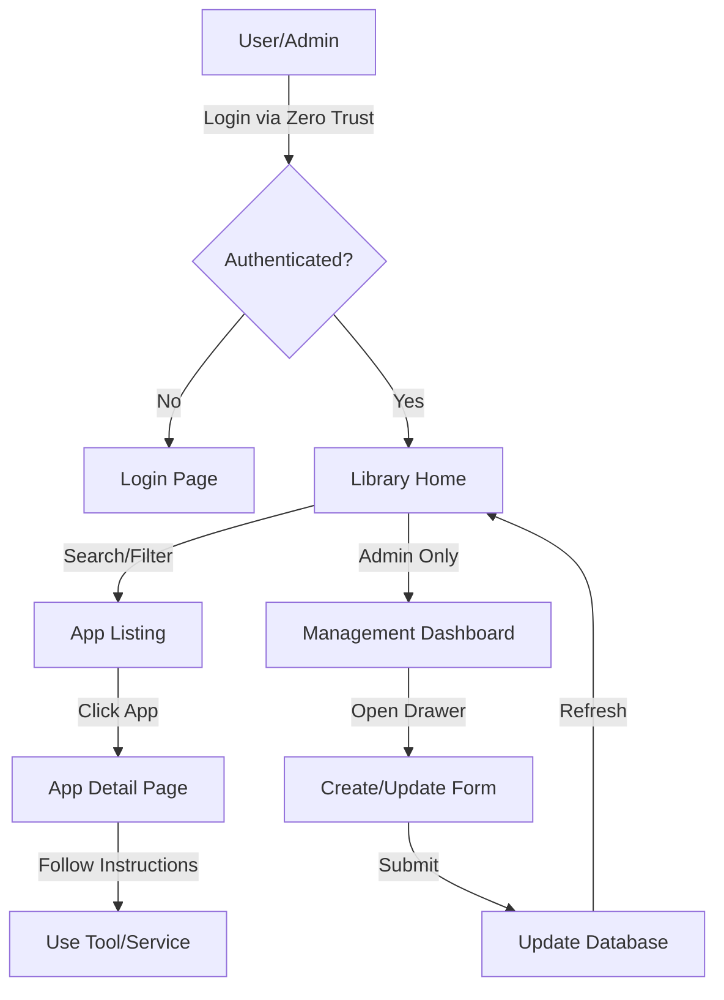

# Adapter Library

Adapter Library คือแอปภายในองค์กรสำหรับแสดงและเข้าถึง Library ของแอป/เครื่องมือภายใน (เช่น MCP, APIFY, MEDIA, APP) โดยเน้นความปลอดภัย, Server-first rendering และโครงสร้างที่แยกชั้น UI กับ Business Logic ชัดเจน

## Tech Stack

- Next.js 16 (App Router)
- React 19
- TypeScript 5
- Tailwind CSS 4
- Shadcn UI / Radix
- Zod 4 (strict validation)
- NextAuth.js 4 (มี endpoint รองรับ)
- Zero Trust Google Login script flow (ใช้งานจริงในหน้า login/callback)

## Current Architecture Summary

- Routing หลักของแอปอยู่ใต้ `/apps` และรายละเอียดแอปที่ `/apps/[id]`
- มีการ redirect รองรับเส้นทางเก่า `/library/apps -> /apps` ผ่าน `next.config.ts`
- Data fetching หลักอยู่ใน `src/core/services/library.service.ts`
- API base URL บังคับผ่าน env `NEXT_PUBLIC_STORE_API_BASE_URL`
- Auth ที่ใช้งานจริงเป็น Zero Trust flow:
  - ปุ่ม login จาก script `/login-adapterstore/login-button.js`
  - callback ที่ `/callback`
  - บันทึก token เป็น httpOnly cookie (`zt_token`) ผ่าน `/api/auth/zt-cookie`
- Route protection ใช้ `src/proxy.ts` ตรวจ cookie `zt_token`

## Security Highlights

- Proxy ใส่ Content Security Policy (CSP) แบบ nonce ต่อ request
- ใส่ security headers เพิ่มเติมทั้งใน `src/proxy.ts` และ `next.config.ts`
- Private routes redirect ไป `/login` อัตโนมัติถ้าไม่มี `zt_token`
- Route สาธารณะหลัก: `/login`, `/callback`, `/api/auth/*`

## Environment Variables

ไฟล์ตัวอย่างอยู่ที่ `.env.example`

ค่าที่ใช้งานในโค้ดปัจจุบัน:

- `GOOGLE_CLIENT_ID`
- `GOOGLE_CLIENT_SECRET`
- `ALLOWED_EMAIL_DOMAIN`
- `NEXT_PUBLIC_STORE_API_BASE_URL`
- `NEXT_PUBLIC_ZT_AUTH_BASE_URL` (optional, มี fallback)
- `NEXT_PUBLIC_ZT_CLIENT_ID` (optional, มี fallback)
- `NEXT_PUBLIC_ZT_CALLBACK_PATH` (optional, default `/callback`)
- `NEXT_PUBLIC_ZT_DEBUG_CALLBACK` (optional, สำหรับ debug callback flow)

## Getting Started

1. Install dependencies

```bash
npm install
```

2. Prepare env

```bash
cp .env.example .env.local
```

3. Run dev server

```bash
npm run dev
```

4. Build production

```bash
npm run build
```

5. Start production server

```bash
npm run start
```

## Project Structure

```text
src/
  app/            UI pages, routes, layouts (App Router)
  components/     Shared UI components
  core/
    interfaces/   Contracts/types for domain and API responses
    validators/   Zod schemas (boundary validation)
    services/     API/service layer
    adapters/     External-to-internal data transformation
  lib/            Shared helpers (auth, sanitize, utils)
  types/          App/global type augmentation
  proxy.ts        Route guard + CSP/security headers
```

## Project Workflow

### 1. Requirement: สรุปปัญหาและเป้าหมาย (Why)
*   **Problem**: เครื่องมือภายใน (Internal Tools), MCP, และ AI Models กระจัดกระจายอยู่ตามทีมต่างๆ ทำให้ยากต่อการค้นหาและนำกลับมาใช้ใหม่ (Low Reusability)
*   **Goal**: สร้าง "Collective Brain" ของเอเจนซี่ โดยเป็นแพลตฟอร์มเดียวที่รวมทุกเครื่องมือ, ชุดข้อมูล และทักษะที่ทีมสร้างขึ้น เพื่อให้ทุกคนเข้าถึงและใช้งานได้ทันทีเมื่อต้องการ

### 2. Key Features: รายการฟีเจอร์หลัก (What)
*   **App Discovery**: ค้นหาและคัดกรองแอปพลิเคชันตามหมวดหมู่ (เช่น MCP, Tools, Platform, AI)
*   **App Detailed Information**: แสดงวิธีใช้งาน (Instructions), แท็ก (Tags) และลิงก์เข้าใช้งานโดยตรง (CTA Link)
*   **Centralized Management**: ระบบหลังบ้านสำหรับ Admin ในการเพิ่ม/แก้ไข/ลบ ข้อมูลแอปและโมเดล AI
*   **Secure Authentication**: ระบบล็อกอินผ่าน Adapter Zero Trust เพื่อความปลอดภัยของข้อมูลภายใน
*   **Premium User Experience**: หน้าจอแบบ Responsive ที่มาพร้อมกับ Animation ที่นุ่มนวลและระบบ Drawer (Sheet) สำหรับการจัดการข้อมูลโดยไม่ต้องสลับหน้า

### 3. System/User Flow


### 4. UI/Wireframe Concept: อธิบายองค์ประกอบหน้าจอที่สำคัญ
*   **Library Shell**: ส่วน Header ที่คงที่ ประกอบด้วยช่อง Search Global, เมนูนำทาง (Home, About) และส่วน Profile
*   **App Catalog**: การจัดวางแบบ Grid Layout ที่แสดงการ์ดแอปพลิเคชัน แยกตามหมวดหมู่ชัดเจน
*   **Management Drawer**: ใช้ระบบ **Right-aligned Sheet** สำหรับฟอร์ม Create/Update เพื่อให้ Admin สามารถแก้ไขข้อมูลได้รวดเร็วโดยยังเห็นบริบทของหน้ารายการเดิมอยู่
*   **Visual Aesthetics**: ใช้โทนสีแบรนด์ (Rich Mahogany/Dark Garnet) พร้อมการเคลื่อนไหวแบบ Staggered Entrance (การทยอยปรากฏของเมนู) เพื่อความพรีเมียม

### 5. Development Backlog

| Area | Task | Status |
| :--- | :--- | :--- |
| **Frontend** | พัฒนา Library Shell และระบบ Responsive Navigation | ✅ Done |
| **Frontend** | ระบบค้นหาและตัวกรอง Category แบบ Dynamic | ✅ Done |
| **Frontend** | พัฒนา Management Drawer ด้วย Shadcn UI และ Image Upload | ✅ Done |
| **Frontend** | เพิ่ม Animation แบบ Staggered และ Smooth Transitions | ✅ Done |
| **Backend** | พัฒนา API สำหรับการดึงรายการแอปและการจัดการ (CRUD) | ✅ Done |
| **Backend** | ระบบ Authentication Integration กับ Zero Trust | ✅ Done |
| **Database** | ออกแบบ Schema สำหรับ App Records, Tags และ AI Models | ✅ Done |

## Documentation

- Contributor/developer rules: `.github/project-guidlines.md`
- Agent execution rules: `AGENTS.md`
- Component naming/structure standard: `src/components/COMPONENTS.md`
