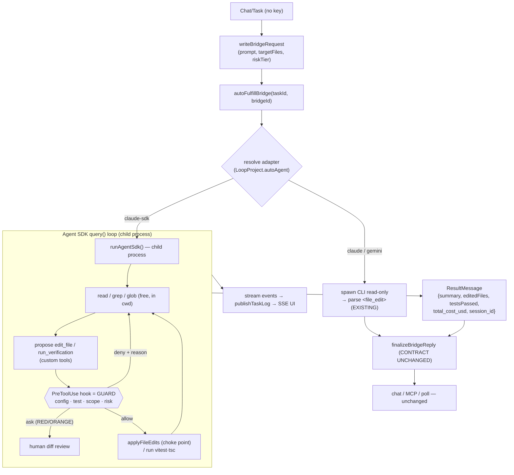

# Agent SDK Integration — Design Concept

> **Status:** Draft / Concept (pre-implementation) · **Date:** 2026-07-19 · **Owner:** jetsada
>
> This is a concept design. No code has been written yet. It captures the target
> architecture, the **verified** Claude Agent SDK facts it depends on, the guard
> model, and the build sequence — so the team (and AI agents) can execute from a
> single spec.

## 1. Goal

Turn Loop Studio's agents from **one-shot LLM calls** (`callAgentLLM(prompt) → <file_edit>` blocks, applied once) into a **real agentic loop** (read → grep → edit → run tests → see result → iterate) — **without re-implementing code editing ourselves**. We do this by embedding the **Claude Agent SDK** as the execution engine behind the existing bridge worker, while keeping Loop Studio as the control plane (orchestration, guards, verification, human oversight, knowledge).

Working model: the operator drives a **team of AI agents by spec**, not by hand-coding. This doc is that spec.

## 2. Current architecture (what exists today)

- **Bridge worker** (`loop-bridge-worker.service.ts`) holds an **adapter registry** (`ADAPTERS`: `claude` | `gemini`). `autoFulfillBridge(taskId, bridgeId)` spawns the selected CLI **read-only** (`Read,Grep,Glob`), captures a text reply containing `<file_edit>` blocks.
- **Guarded apply** (`applyFileEdits` in `loop-file-guards.ts`) is the **single choke point**: path-traversal, config lock, test-file policy, and **task-scope** (`targetFiles`) guards. Reused by the bridge POST route, MCP `submit_bridge_reply`, chat route, and the collaboration pipeline.
- **finalizeBridgeReply** (`loop-bridge-apply.service.ts`) applies edits + records the assistant message; the chat/MCP/poll surfaces read the result.
- **Durability:** tmux mode + `recoverTmuxBridges()` on boot (restart recovery).
- **Collaboration pipeline** (`loop-collaboration.service.ts`) runs a fixed 5-step team (Architect → Developer → QA → DevOps → Auditor); each step is a single completion, with a bounded fix loop.

**Limitation:** agents cannot read the whole repo on demand, cannot run tests themselves, and cannot iterate — they emit one diff and stop.

## 3. Design principle (non-negotiable)

> **Every mutating action (file write, shell command) must pass through one guard choke point.** Autonomy may increase; the guard invariant may not weaken.

Because the SDK can write anywhere on disk (see §4, item 8), we must **not** let it touch the filesystem directly. All writes/commands go through Loop-Studio-owned tools gated by a `PreToolUse` hook.

## 4. Verified Claude Agent SDK spec (fetched 2026-07-19)

Source: `https://code.claude.com/docs/en/agent-sdk/*`. Confirmed against the live docs.

| # | Capability | Verdict | Real API |
|---|---|---|---|
| 1 | Entry point | ✅ | `query({ prompt, options })` from `@anthropic-ai/claude-agent-sdk` → async generator |
| 2 | `canUseTool` per-call permission | ⚠️ **shadowed** | Exists, but **NOT fired** for tools auto-approved by `allowedTools`/`acceptEdits`/`bypassPermissions` (warns `CLAUDE_SDK_CAN_USE_TOOL_SHADOWED`). **Do not rely on it as the choke point.** |
| 3 | Custom in-process tools | ✅ | `tool(name, desc, zodSchema, handler)` + `createSdkMcpServer()`; registered via `options.mcpServers` |
| 4 | Restrict built-ins | ✅ | `disallowedTools: ["Write","Bash"]`, `allowedTools: ["Read","Glob","Grep","mcp__loop__*"]` |
| 5 | **Hooks** | ✅ **use this** | `PreToolUse` runs **first**, before all permission checks; `permissionDecision:"deny"` is final (beats `bypassPermissions`). This is the true choke point. |
| 6 | Permission modes | ✅ | `default` / `plan` (propose, don't execute) / `dontAsk` / `acceptEdits` / `bypassPermissions` / `auto` |
| 7 | Auth | ✅ | Keyless machine login (like the CLI) **or** `ANTHROPIC_API_KEY`; fallback: key → app login → error |
| 8 | Filesystem sandbox | ❌ **none built-in** | `options.cwd` pins working dir, but no OS-level sandbox. Must isolate via child process / container / branch-per-task. |
| 9 | Streaming events | ✅ | `includePartialMessages:true` → `stream_event` + `AssistantMessage`/`ResultMessage` |
| 10 | Budget/limits | ✅ | `options.maxTurns`, `options.maxBudgetUsd`; `ResultMessage` carries `total_cost_usd`, `usage`, `num_turns` |
| 11 | Sessions / durability | ✅ | `session_id` + `options.resume`, `forkSession`, `AbortController` for cancel/timeout |
| 12 | Model selection | ✅ | `options.model`; docs examples lag (show `claude-opus-4-6`) — this environment's Opus is `claude-opus-4-8`. **Prefer alias `opus`/`sonnet` or `query(...).supportedModels()` at runtime** over hardcoding. |

**Correction from the first concept:** the choke point is the **`PreToolUse` hook**, *not* `canUseTool` (which can be silently bypassed).

## 5. Target architecture

Add an SDK-backed adapter to the existing registry. Generalize the adapter shape from "spawn a CLI" to "run a function":

```
Adapter =
  | { kind: "spawn"; ... }   // existing claude/gemini CLI adapters — unchanged
  | { kind: "sdk";   run(ctx): Promise<AgentRunResult> }   // new: runs query() loop
```

Selected per project via `LoopProject.autoAgent = "claude-sdk"` (Edit Project modal) — **opt-in, backward compatible**. Existing CLI adapters remain as fallback.

### 5.1 Flow: before → after



### 5.2 Guarded tool surface given to the agent

| Tool | Access | Guard (in PreToolUse hook) |
|---|---|---|
| `Read` / `Grep` / `Glob` (built-in) | free, within `cwd` | path-traversal only |
| `edit_file` (custom) | **guarded** | `classifyProtectedPath` (config lock, test policy) + scope (`targetFiles`) → `applyFileEdits` |
| `run_verification` (custom) | Loop Studio runs vitest/tsc/build | result fed back to the agent as tool output |
| `run_command` (custom, opt-in) | **guarded** | allowlist + risk tier (RED/ORANGE → human) |
| built-in `Write` / `Bash` | **disallowed** | removed from context so every mutation routes through custom tools |

The `PreToolUse` hook reuses the **existing** guard functions — no new guard logic, just moved to the tool-call boundary.

### 5.3 Risk-tier human gate

- GREEN / YELLOW → `permissionMode: "default"`, edits auto-apply through guards.
- RED / ORANGE → `permissionMode: "plan"` (or hook returns `ask`) → surface a **diff review** in the UI before applying.

### 5.4 Bridge contract preservation

The result written back via `finalizeBridgeReply` becomes a **summary + editedFiles + verification outcome** (not `<file_edit>` blocks — those were already applied through guards during the loop). Everything downstream (chat UI, MCP, poll) is unchanged.

### 5.5 Durability / recovery

- Run `query()` in a **child worker process** (SDK has no sandbox; isolation + kill/timeout needed).
- Persist `session_id`; on restart, `recoverTmuxBridges()`-style recovery resumes via `options.resume` or finalizes/errors an orphaned run.
- `AbortController` for cancel + `maxTurns`/`maxBudgetUsd` for hard stops.

## 6. Prerequisite (confirmed required)

Because the SDK has **no filesystem sandbox** (§4 item 8) and the agent now writes many files autonomously, **branch-per-task + checkpoint/rollback** is a hard prerequisite, not optional:

- Each task runs on its own git branch in the target repo.
- Commit a checkpoint before/around agent runs → one-command rollback.
- Combined with `cwd` pinning + the PreToolUse guard, this is the safety net that makes write-autonomy acceptable.

## 7. Build sequence

Design order ≠ build order. Build in this dependency order:

1. **Branch-per-task + checkpoint/rollback** (§6) — safety foundation. Must land first.
2. **Guarded tool server + PreToolUse hook** (§5.2) — the choke point; reuses existing guards.
3. **SDK adapter wiring** (§5) — `query()` loop into the bridge worker; stream → log; result → `finalizeBridgeReply`.
4. **Opt-in rollout** — enable on one project (`autoAgent="claude-sdk"`), observe cost/quality/logs, then expand.

## 8. Decisions & open questions

**Decided**
- Choke point = `PreToolUse` hook (not `canUseTool`).
- SDK agent runs in a child process; built-in `Write`/`Bash` disallowed.
- Opt-in per project; CLI adapters stay as fallback.
- Model via alias / `supportedModels()`, default to latest Opus (`claude-opus-4-8` in this env).

**Open**
- Sandbox depth: child process + branch-per-task only, or full container (`mcr.microsoft.com/...` / gVisor) for untrusted repos?
- `run_command` scope: allowlist which shell commands (beyond vitest/tsc/build) the agent may run?
- Budget policy: per-task `maxBudgetUsd` default and where the operator sets it (project vs task).
- Session persistence store: reuse `.antigravity/` (e.g. `agent-session-<taskId>.json`) for `session_id` + recovery metadata.
- Concurrency: how many SDK child processes may run at once (per-agent queue)?

## 9. Tradeoffs

| Gain | Cost |
|---|---|
| Real iteration (agent sees test output, fixes itself) | Higher token/$ per task → needs `maxBudgetUsd` caps |
| Flexible toolset | Must maintain the guarded tool server + hook mapping |
| Reuses existing guards & bridge contract | Long-running loops → child-process lifecycle + recovery |
| Native budget/session/streaming | No SDK sandbox → branch-per-task + isolation mandatory |

## 10. Rollout / backward compatibility

- New adapter is additive; nothing existing changes behavior.
- Guards, verification, and the bridge contract are reused as-is → blast radius is contained.
- Gate behind `autoAgent="claude-sdk"` (per project) + an env flag for a global default; ship dark, enable on one project first.
