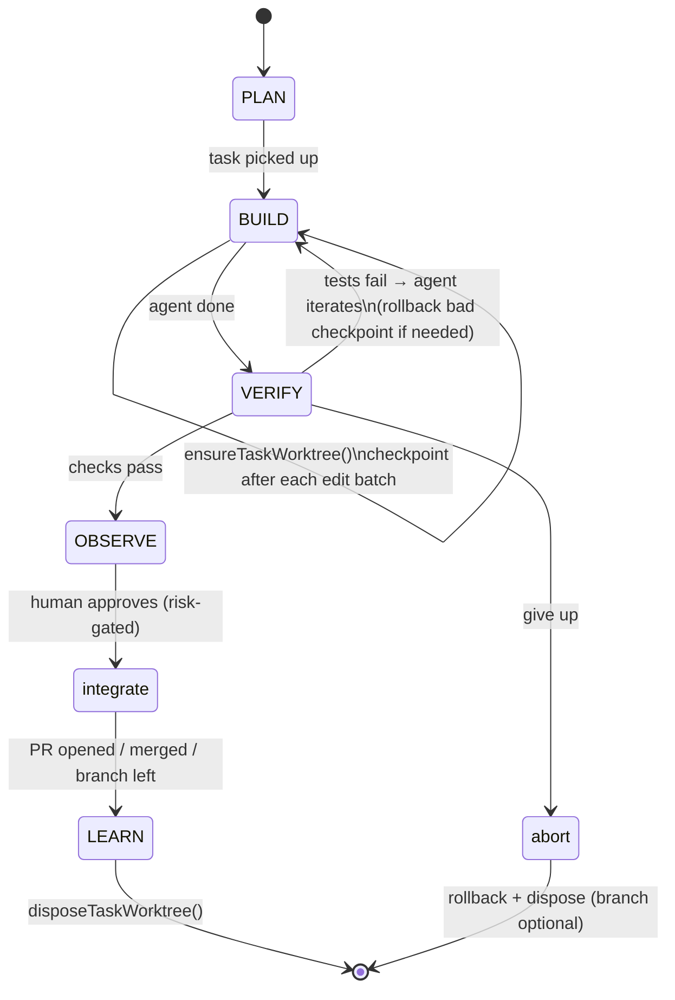

# Branch-per-Task + Checkpoint / Rollback — Design Concept

> **Status:** Draft / Concept (pre-implementation) · **Date:** 2026-07-19 · **Owner:** jetsada
>
> Build step 1 of [Agent SDK Integration](./agent-sdk-integration.md). This is the
> **safety foundation** — it must land before agents are given write-autonomy,
> because the Agent SDK has no filesystem sandbox. Concept only; no code yet.

## 1. Why this is first

Today every agent edit (`applyFileEdits`) writes **directly into the target repo's current working tree / branch**. That is acceptable for one-shot diffs, but the moment an agent iterates autonomously (writes many files, runs commands), we need:

1. **Isolation** — the agent must not touch the operator's own checkout or another task's work.
2. **Rollback** — any run must be undoable to a known-good point in one action.
3. **A filesystem boundary** — the SDK can write anywhere (no sandbox); we need a real directory boundary to pin its `cwd` to.

All three are solved by the same mechanism: **a dedicated git worktree + branch per task, with checkpoint commits.**

## 2. Core decision: git **worktree** per task (not branch checkout)

A naive "checkout `loop/task-x` in the repo's main dir" is wrong: it disturbs the operator's working copy and blocks concurrent tasks. Instead, each task gets its **own worktree**:

```
git worktree add <worktreeDir> -b loop/task-<taskId> <baseRef>
```

Why worktree:
- **Isolation** — the operator's main checkout is never touched.
- **Concurrency** — many tasks on the same repo run in parallel (Loop Studio already supports concurrent bridges).
- **Sandbox boundary** — the agent's `cwd` = `<worktreeDir>`; combined with the PreToolUse guard, this is the write boundary the SDK lacks.
- **Precedent** — mirrors Claude Code's own `isolation: "worktree"`.

**Location:** `<repoRoot>/.antigravity/worktrees/<taskId>/` (gitignored runtime state, consistent with the rest of `.antigravity/`), or a configurable sibling dir for large repos.

## 3. Branch & checkpoint model

- **Branch:** `loop/task-<taskId>` (stable, greppable; one per task). Base = the target repo's default branch (or an operator-chosen base) captured as `baseSha`.
- **Checkpoints:** a git commit after each **guarded edit batch** (or agent turn), authored by Loop Studio, with a structured message:
  ```
  loop-checkpoint(<stage>): <short label>
  taskId=<id> step=<n> agent=<role>
  ```
  Every checkpoint is a rollback target and a diff boundary. The whole task branch is the cumulative diff vs `baseSha`.
- **Rollback granularity:** to the previous checkpoint (`git reset --hard <sha>`), to a specific checkpoint, or discard the whole task (`git worktree remove --force` + `git branch -D`).

## 4. Where it plugs in

Built on the existing `executeGitCommand(projectPath, args)` primitive (`loop-git.service.ts`). Add a focused service, e.g. `loop-worktree.service.ts` / `loop-checkpoint.service.ts`:

| Function (concept) | Does |
|---|---|
| `ensureTaskWorktree(taskId, projectPath, base)` | create worktree + branch if absent; return `{worktreeDir, branch, baseSha}` |
| `checkpoint(taskId, {stage, label})` | `git add -A && git commit` in the worktree; append `{sha,label,stage,ts}` to the task record |
| `rollbackTo(taskId, sha)` | `git reset --hard <sha>` in the worktree |
| `listCheckpoints(taskId)` | read from the task record |
| `integrateTask(taskId, mode)` | see §7 (PR / merge / leave) |
| `disposeTaskWorktree(taskId, {keepBranch})` | `git worktree remove` (+ optional `git branch -D`) |

**All agent runners point their `cwd` at the worktree:** the SDK adapter, the bridge worker, and the collaboration pipeline pass `worktreeDir` instead of the raw `projectPath`. `applyFileEdits` stays the guarded choke point — it just writes inside the worktree.

## 5. Lifecycle (mapped to the 6-stage loop)



- **BUILD:** worktree created on first edit; checkpoint per edit batch → the agent's fix-loop can `rollbackTo` a checkpoint instead of digging out of a bad state.
- **VERIFY:** `run_verification` runs inside the worktree; a red run can trigger rollback-and-retry.
- **OBSERVE → integrate:** risk-tier gate — GREEN/YELLOW may auto-integrate; RED/ORANGE require human diff review first.
- **LEARN:** dispose the worktree (keep or delete the branch per policy).

## 6. State persistence & recovery

Store git state on the task record (`.antigravity/loop-projects.json`) so runs survive an app restart (same principle as `recoverTmuxBridges()`):

```
task.git = {
  worktreeDir, branch, baseSha,
  checkpoints: [{ sha, label, stage, ts }],
  integration: { mode, ref?, prUrl? } | null
}
```

On boot, a recovery pass reconciles: worktree exists + branch present → resume; worktree gone but branch present → re-add worktree from branch tip; neither → mark the task's git state stale.

## 7. Integrating a finished task back

Loop Studio drives **other** repos and is local/single-user, so default to non-destructive:

| Mode | Behavior | When |
|---|---|---|
| `leave-branch` (default) | keep `loop/task-<id>`; operator merges | safest; always available |
| `open-pr` | `gh pr create` from the task branch → target's default branch | repo has a remote + `gh` |
| `merge` | fast-forward / merge into base if clean | GREEN + operator opted in |

Never auto-merge RED/ORANGE. Conflicts on integrate → surface to the operator (never auto-resolve).

## 8. Edge cases (must handle)

- **Target isn't a git repo** → `isOwnGitRepo()` false → skip worktree; fall back to current direct-write behavior + warn (or refuse write-autonomy).
- **Dirty base / operator's uncommitted work** → worktree branches from a committed `baseSha`; the operator's dirty main checkout is untouched (worktree isolates it). Do **not** stash the operator's tree.
- **Concurrent tasks, same repo** → separate worktrees, separate branches → safe.
- **Base moved during a task** → integrate against the recorded `baseSha`; rebase/merge is an explicit operator action, not automatic.
- **Worktree/branch already exists** (re-run) → reuse if it matches taskId, else error rather than clobber.
- **Disk usage** → worktrees cost disk; dispose on LEARN; a GC pass removes orphaned `loop/task-*` worktrees for closed tasks.
- **Detached HEAD / submodules / LFS** → detect and degrade gracefully; document unsupported cases.

## 9. Guard interaction

Checkpoints wrap **around** the existing guards; they do not replace them. Order per edit:
```
agent proposes edit
  → PreToolUse guard (config/test/scope/risk)   ← unchanged choke point
    → applyFileEdits writes into the worktree
      → checkpoint() commits it
```
Rollback reverts checkpoints; it never bypasses a guard.

## 10. Build sub-steps (implement in this order)

1. `loop-worktree.service.ts` — `ensureTaskWorktree` / `disposeTaskWorktree` on `executeGitCommand`; task-record `git` field; `.gitignore` `.antigravity/worktrees/`.
2. Point existing runners' `cwd` at the worktree (bridge worker, collaboration) — behind a per-project opt-in; default off = current behavior.
3. `checkpoint()` + `rollbackTo()` + record wiring; checkpoint after each guarded edit batch.
4. Boot recovery pass (reconcile worktree/branch/record).
5. `integrateTask()` (`leave-branch` first; `open-pr`/`merge` later) + UI (branch, checkpoints, diff, rollback, integrate).
6. GC for orphaned worktrees.

Only after 1–4 are solid should the SDK adapter (Agent SDK step 3) be allowed write-autonomy.

## 11. Decisions & open questions

**Decided**
- Worktree per task (not branch checkout).
- Branch `loop/task-<taskId>`; checkpoints are Loop-Studio-authored commits.
- Never touch the operator's main checkout or stash their work.
- Default integration = `leave-branch`; never auto-merge RED/ORANGE.
- Opt-in per project; git-less targets fall back to current behavior.

**Open**
- Worktree location: inside `.antigravity/worktrees/` vs configurable sibling (big repos, disk).
- Checkpoint granularity: per edit batch vs per agent turn vs per tool call (cost vs undo resolution).
- Retention: auto-delete task branches after integrate, or keep for audit?
- Checkpoint authorship/identity (a dedicated git author for loop commits?).
- Interaction with the target repo's own hooks/CI on the task branch.

## 12. Tradeoffs

| Gain | Cost |
|---|---|
| True isolation + safe rollback (unblocks agent autonomy) | Disk per worktree; lifecycle + GC to maintain |
| Concurrent tasks on one repo | More git orchestration + recovery logic |
| Natural `cwd` boundary for the sandbox-less SDK | Integration-back UX (PR/merge/conflicts) to design |
| Full per-task diff & audit trail | Task record grows a `git` sub-object + recovery pass |
