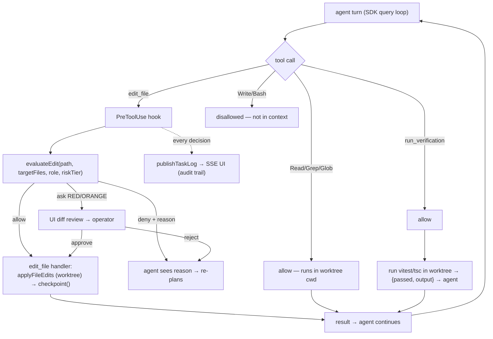

# Guarded Tool Server + PreToolUse Hook — Design Concept

> **Status:** Draft / Concept (pre-implementation) · **Date:** 2026-07-19 · **Owner:** jetsada
>
> Build step 2 of [Agent SDK Integration](./agent-sdk-integration.md), on top of
> [Branch-per-Task + Checkpoint](./branch-per-task-checkpoint.md). This is the
> **choke point** that keeps an autonomous agent inside the rules. Concept only.

## 1. Goal

Give the SDK agent a real toolset (read / edit / run tests / iterate) while forcing
**every mutating action through one guard** — reusing the guards that already exist
in [`loop-file-guards.ts`](../src/core/services/loop-file-guards.ts) (config lock,
test-file policy, task scope, path traversal) plus the risk tier
(`calculateRiskTier`). No new guard logic — the same rules, moved to the tool-call
boundary.

## 2. Two-layer defense

**Layer A — shrink the attack surface.** Remove the built-in mutators so the agent
*cannot* write or shell out except through our tools:

```
disallowedTools: ["Write", "Bash", "Edit"]        // built-in mutators removed
allowedTools:    ["Read", "Glob", "Grep",         // read-only built-ins: free
                  "mcp__loop__edit_file",
                  "mcp__loop__run_verification"]   // our guarded tools
```

**Layer B — the choke point.** A **`PreToolUse` hook** validates every tool call
*before* it runs. Verified fact: `canUseTool` is silently skipped when a tool is
auto-approved, so it is **not** safe as the gate. `PreToolUse` runs first and its
`permissionDecision: "deny"` is final (beats even `bypassPermissions`). See the
[SDK spec table](./agent-sdk-integration.md#4-verified-claude-agent-sdk-spec-fetched-2026-07-19).

Layer A alone is not enough (a permission mode could re-enable a built-in); Layer B
is the guarantee. Both together = defense in depth.

## 3. The guarded tools (custom, in-process)

Defined via `tool(name, desc, zodSchema, handler)` + `createSdkMcpServer({ name: "loop", tools: [...] })`, registered on `options.mcpServers`.

| Tool | Input (zod) | Handler does | Guarded by |
|---|---|---|---|
| `edit_file` | `{ path, content }` | write **inside the task worktree** via `applyFileEdits`, then `checkpoint()` | config lock · test policy · scope · traversal |
| `run_verification` | `{ kind: "vitest"\|"tsc"\|"build", target? }` | run in the worktree via `runProjectCommand`; return `{passed, output tail}` to the agent | none (read-only signal) |
| `run_command` *(opt-in)* | `{ cmd, args }` | run an **allowlisted** command in the worktree | command allowlist + risk tier |

`run_verification` is what turns the one-shot pipeline into a real loop: the agent
runs tests, *sees the failure output*, and fixes itself.

## 4. The PreToolUse guard (the heart)

### 4.1 Reuse existing guards — extract a pure evaluator

Today `applyFileEdits` couples *decide* + *write*. Split out the decision so the
hook and the tool handler share one source of truth:

```
// concept — pure, no fs
evaluateEdit(relPath, { targetFiles, allowTestFiles, riskTier })
  → { decision: "allow" | "deny" | "ask", reason }
```
Built from the functions already in `loop-file-guards.ts` (`classifyProtectedPath`,
`normalizeRel`, `pathStem`, scope check). `applyFileEdits` then calls
`evaluateEdit` too → guards can never drift between the two paths.

### 4.2 Decision logic

```
PreToolUse(toolName, input):
  if toolName == "mcp__loop__edit_file":
      e = evaluateEdit(input.path, {targetFiles, allowTestFiles(role), riskTier})
      return map(e)                       # allow / deny(reason) / ask
  if toolName == "mcp__loop__run_command":
      if cmd not in allowlist:            return deny("command not allowlisted")
      if riskTier in {RED,ORANGE}:        return ask("high-risk command")
      return allow
  if toolName in {Read,Grep,Glob,run_verification}:
      return allow                        # confined to worktree cwd
  default:                                return deny("tool not permitted")
```

- `deny(reason)` → the agent **sees the reason** and re-plans (e.g. "config is protected" → it stops trying to edit `package.json`).
- `ask(...)` → surface a **diff / command review** in the UI; operator approves before it proceeds (risk-tier gate, ties into `permissionMode: "plan"`).

### 4.3 Risk-tier mapping

| Risk tier | edit_file | run_command |
|---|---|---|
| GREEN / YELLOW | allow (through guards) | allow (allowlisted) |
| ORANGE / RED | **ask** (human diff review) | **ask** |

## 5. End-to-end flow



## 6. Relationship to the other steps

- **Step 1 (worktree):** the `edit_file` handler writes into the **task worktree**, and `checkpoint()` commits after each accepted edit → the guard decides, the worktree contains, the checkpoint makes it undoable.
- **Step 3 (SDK adapter):** wires this tool server + hook into `query(options)`. The adapter owns the loop; this doc owns the rules.

Choke-point ordering per edit (unchanged invariant):
```
agent → PreToolUse guard → applyFileEdits (worktree) → checkpoint
```

## 7. Observability

Every guard decision (`allow`/`deny`/`ask` + reason + tool + path) is streamed to
the task log (`publishTaskLog` → SSE). This gives the operator a live, auditable
trace of *what the agent tried* and *why it was allowed or blocked* — essential for
trusting an autonomous agent.

## 8. Edge cases

- Agent invokes built-in `Write`/`Bash` → not in context (Layer A); if surfaced anyway, `PreToolUse` default-denies (Layer B).
- Edit to `package.json` / `vitest.config.ts` / `.github/workflows/**` → `classifyProtectedPath="config"` → **deny** (all roles).
- Test file by a non-QA role → deny (test policy); QA writing a test sibling of an in-scope target → allow (existing rule).
- Off-scope path (not in `targetFiles`, no in-scope stem) → deny.
- Path traversal / outside worktree root → deny.
- `run_command` not allowlisted → deny; allowlisted but RED/ORANGE → ask.
- `ask` with no operator present (headless/auto-run) → default to deny (fail safe) unless the project explicitly opted into auto-approve for that tier.

## 9. Build sub-steps

1. Extract `evaluateEdit()` (pure) from `applyFileEdits`; make `applyFileEdits` call it (no behavior change; add tests).
2. `loop-agent-tools.ts` — define `edit_file` / `run_verification` via `tool()` + `createSdkMcpServer()`; `edit_file` writes to the worktree + `checkpoint()`.
3. `loop-pretooluse-guard.ts` — the `PreToolUse` hook calling `evaluateEdit` + command allowlist + risk mapping; stream decisions to the task log.
4. Wire `ask` → the UI diff/command review surface (reuse the risk-tier gate).
5. `run_command` (opt-in) + allowlist config, last.

Steps 1–3 are pure/unit-testable **without** the SDK (feed synthetic tool inputs) — build and prove the guard before the adapter (step 3 of the parent plan) exists.

## 10. Decisions & open questions

**Decided**
- `PreToolUse` hook is the choke point (not `canUseTool`).
- Built-in `Write`/`Bash`/`Edit` disallowed; all mutation via custom `mcp__loop__*` tools.
- One shared pure `evaluateEdit()` behind both the hook and `applyFileEdits`.
- `ask` fails safe (deny) when headless.

**Open**
- `run_command` allowlist contents (git status/diff? formatters? package installs?).
- Per-role `allowTestFiles`: how the SDK agent's "role" is set (project config? task? single implementer role?).
- Whether `run_verification` results should also auto-checkpoint (green test = checkpoint tag?).
- `ask` UX: block the agent loop synchronously vs park the task for async approval.

## 11. Tradeoffs

| Gain | Cost |
|---|---|
| One choke point, guards reused, no drift | Small refactor to split decide/write in `applyFileEdits` |
| Agent self-corrects (sees deny reasons + test output) | Guard must return *useful* reasons (prompt-quality matters) |
| Testable without the SDK | Extra tool-server + hook surface to maintain |
| Full audit trail of agent intent | `ask` UX + headless fail-safe to design |
