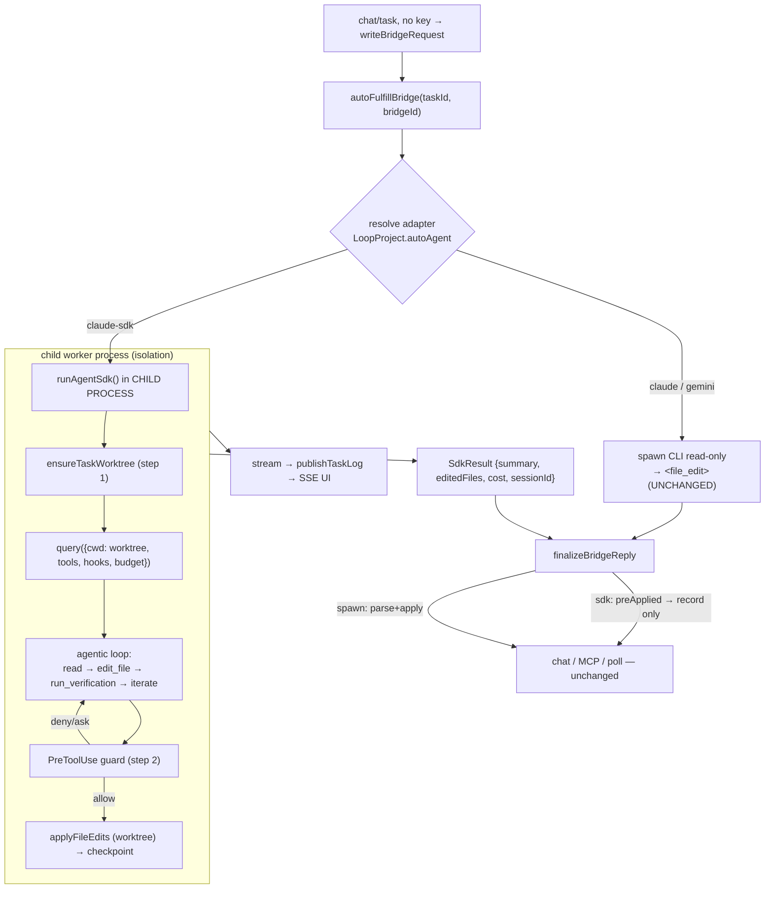

# SDK Adapter Wiring — Design Concept

> **Status:** Draft / Concept (pre-implementation) · **Date:** 2026-07-19 · **Owner:** jetsada
>
> Build step 3 (final) of [Agent SDK Integration](./agent-sdk-integration.md).
> Wires the Claude Agent SDK `query()` loop into the bridge worker, using the
> [task worktree](./branch-per-task-checkpoint.md) as `cwd` and the
> [guarded tools + PreToolUse hook](./guarded-tools-pretooluse.md) as the choke
> point. **Do not build this until steps 1–2 are solid.** Concept only.

## 1. Goal

Add a `claude-sdk` adapter to the existing registry (`loop-bridge-worker.service.ts`)
that runs a **real agentic loop** — reusing everything already designed: worktree
isolation (step 1), guarded tools + `PreToolUse` (step 2), and the existing bridge
contract so chat / MCP / poll surfaces are unchanged.

## 2. Generalize the adapter registry

The current registry runs spawned CLIs and returns `{ exitCode, stdout, timedOut }`,
then `finalizeBridgeReply` parses `<file_edit>` from `stdout`. The SDK adapter
**applies edits during the loop** (through guarded tools), so it returns a richer,
already-applied result:

```
Adapter =
  | { kind: "spawn"; run(ctx): Promise<SpawnResult> }   // claude/gemini CLI — unchanged
  | { kind: "sdk";   run(ctx): Promise<SdkResult> }     // new

SdkResult = {
  preApplied: true                 // edits already written+checkpointed in the worktree
  summary: string                  // agent's final message
  editedFiles: string[]            // from accepted edit_file calls
  checkpoints: string[]            // commit shas
  testsPassed: boolean | null
  cost: { totalUsd, inputTokens, outputTokens, numTurns }
  sessionId: string
  status: "done" | "error" | "aborted" | "budget" | "max-turns"
}
```

`finalizeBridgeReply` gets a small branch: **spawn path** = parse+apply `<file_edit>`
(today); **sdk path** = edits are `preApplied`, so record the summary + `editedFiles`
+ verification, mark consumed, **do not re-apply**.

## 3. `runAgentSdk(ctx)` — the loop

```
runAgentSdk({ taskId, projectId, projectPath, prompt, targetFiles, riskTier, onLog }):
  1. worktree = ensureTaskWorktree(taskId, projectPath, base)      # step 1
  2. options = {
       cwd: worktree.dir,                                          # sandbox-less SDK → real boundary
       model: "opus" (alias) or supportedModels()[…],             # latest Opus in this env
       permissionMode: riskTier ∈ {RED,ORANGE} ? "plan" : "default",
       disallowedTools: ["Write","Bash","Edit"],                  # step 2 layer A
       allowedTools: ["Read","Glob","Grep","mcp__loop__*"],
       mcpServers: { loop: guardedToolServer(taskId, worktree) }, # step 2 tools
       hooks: { PreToolUse: [ guardChokePoint(taskId, targetFiles, riskTier) ] }, # step 2 gate
       maxTurns, maxBudgetUsd,                                     # SDK-native caps
       abortController,
       resume: task.git?.sessionId ?? undefined,                  # step-6 recovery
       includePartialMessages: true,
     }
  3. for await (msg of query({ prompt, options })):
       stream_event / AssistantMessage → onLog(...) → publishTaskLog → SSE
       ResultMessage → capture cost, sessionId, status
  4. return SdkResult { summary, editedFiles (from accepted tools), checkpoints, testsPassed, cost, sessionId, status }
```

Auth: keyless machine login (as the CLI adapter today) or `ANTHROPIC_API_KEY` — no change to Loop Studio's key model.

## 4. Where it hooks into the bridge



## 5. Child-process execution + durability

The SDK has no sandbox and a run can be long, so run `query()` in a **child worker
process** (Node `child_process`/worker), not in the Next.js request. This mirrors the
existing tmux durability model:

- Write a run **meta.json** (`taskId/projectId/bridgeId/sessionId/worktree`) into `.antigravity/agent-runs/<taskId>/` — survives an app restart.
- **Boot recovery** (extend `recoverTmuxBridges()` pattern): for each pending bridge with a run dir →
  - child finished (result file present) → `finalizeBridgeReply`;
  - `sessionId` present, process gone → **resume** via `options.resume` in a fresh child;
  - neither → mark interrupted / error.
- **Cancel/timeout** → `AbortController.abort()` + `maxTurns`/`maxBudgetUsd` hard stops; on abort, the worktree + checkpoints remain for inspection/rollback.

Reuse `LOOP_BRIDGE_TMUX`-style opt-in: the SDK child can *also* run inside tmux for attach/observe if desired, but the meta.json + resume recovery is the primary durability path.

## 6. Result → task chat

`finalizeBridgeReply` (sdk branch) records:
- the agent **summary** as the assistant message,
- `editedFiles` + `checkpoints` (link to the task branch/diff),
- verification outcome (`testsPassed`),
- cost/turns (into `task.tokensUsed`).

No `<file_edit>` blocks are emitted or re-applied — they were applied+checkpointed
in the worktree during the loop. Integration back to the target's main branch is the
separate step-1 `integrateTask()` action (leave-branch / PR / merge), risk-gated.

## 7. Effect on the collaboration pipeline (optional, later)

Once the SDK agent iterates on its own (sees `run_verification` output and fixes
itself), the pipeline's hand-rolled fix loop becomes redundant for the Developer
role. The pipeline can **delegate** the BUILD/VERIFY steps to `runAgentSdk` while
keeping maker/checker separation (QA/Auditor still distinct agents). Out of scope
for step 3; noted so the pipeline isn't duplicated.

## 8. Rollout / backward compatibility

- `claude-sdk` is an **additive** registry entry; `spawn` adapters unchanged.
- Enable per project (`autoAgent="claude-sdk"`) or a global env default; ship dark.
- Requires steps 1–2 merged (worktree + guarded tools/hook). Gate the adapter behind their presence.
- First rollout: one low-risk (GREEN) project, watch cost/quality/logs, then expand.

## 9. Build sub-steps

1. Generalize the adapter type (`kind: "spawn" | "sdk"`); keep spawn adapters working.
2. `finalizeBridgeReply` sdk branch (`preApplied` → record, don't re-apply); tests for both branches.
3. `runAgentSdk()` (in-process first, for a fast test loop) wiring worktree + tool server + hook + budget; stream → log.
4. Move `runAgentSdk` into a **child worker process** + meta.json + boot recovery + abort.
5. Opt-in wiring (`autoAgent`, env) + docs (CLAUDE.md/AGENTS.md §7) + one-project rollout.

## 10. Decisions & open questions

**Decided**
- SDK edits are `preApplied` (via guarded tools into the worktree); finalize records, never re-applies.
- Runs in a child process; durability via meta.json + `session_id` resume (tmux-recovery pattern).
- Additive `claude-sdk` adapter, opt-in, gated on steps 1–2.
- Keyless auth preserved; model via alias / `supportedModels()`.

**Open**
- In-process vs child-process for the *first* iteration (child adds durability but slows the build/test loop — do in-process first, then move).
- How `editedFiles` are surfaced: from accepted `edit_file` tool calls vs `git diff --name-only base…HEAD` in the worktree (the latter is authoritative).
- Should `run_verification` failures auto-abort after N turns, or let `maxTurns` handle it?
- Concurrency cap on SDK child processes (per-agent queue).
- Whether to retire the read-only CLI auto-fulfill once `claude-sdk` is proven, or keep it as a lightweight fallback.

## 11. Tradeoffs

| Gain | Cost |
|---|---|
| Full agentic loop, edits pre-applied + checkpointed | `finalizeBridgeReply` gains a branch; result contract widens |
| Reuses worktree + guards + bridge contract | Child-process lifecycle + recovery to build |
| Native budget/session/streaming/abort | Concurrency + cost governance to tune |
| Pipeline fix-loop can be retired later | Migration of the pipeline is extra work (deferred) |

---

## Concept design set — complete

| Step | Doc |
|---|---|
| Overview | [agent-sdk-integration.md](./agent-sdk-integration.md) |
| 1. Worktree + checkpoint | [branch-per-task-checkpoint.md](./branch-per-task-checkpoint.md) |
| 2. Guarded tools + PreToolUse | [guarded-tools-pretooluse.md](./guarded-tools-pretooluse.md) |
| 3. SDK adapter wiring | this doc |

Build order: **1 → 2 (both unit-testable first) → 3 → opt-in rollout.**
